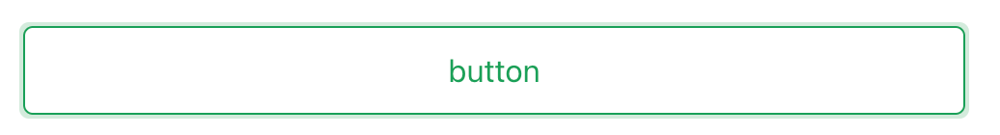

# Introduction

本仓库用于测试组件发布到 npm

## Update

如果有新增组件，步骤如下：
1. 在 `packages` 目录下新增组件，并在 `index.ts` 中导出组件。可参考 `Button` 组件的实现。
2. 执行 `npm run build` 打包组件，重新生成 `dist` 目录。
3. 登录 npm 官网：`npm login`.
4. 切换版本号：`npm version x.x.x`.
5. 发布组件：`npm publish`.

## Tips

注意：
1. 首次发布需要前往 npm 官网确认组件的名称是否唯一，如果名称不唯一，需要前往 `package.json` 文件中修改组件名称。
2. 如果执行 `pnpm build` 报错，请先执行 `yarn add terser -D` 安装 Terser。

## Usage

1. 安装组件：`npm install vue-zeey-ui`.
2. 引入组件：`import { ZButton } from 'vue-zeey-ui'`.
3. 使用组件：`<ZButton>按钮</ZButton>`.
4. 如果样式没有生效，需要在 `main.ts` 中引入 `vue-zeey-ui/css` 文件。

### FIXME

无法全局引入组件，只能按需引入，尚需解决。

### Preview

